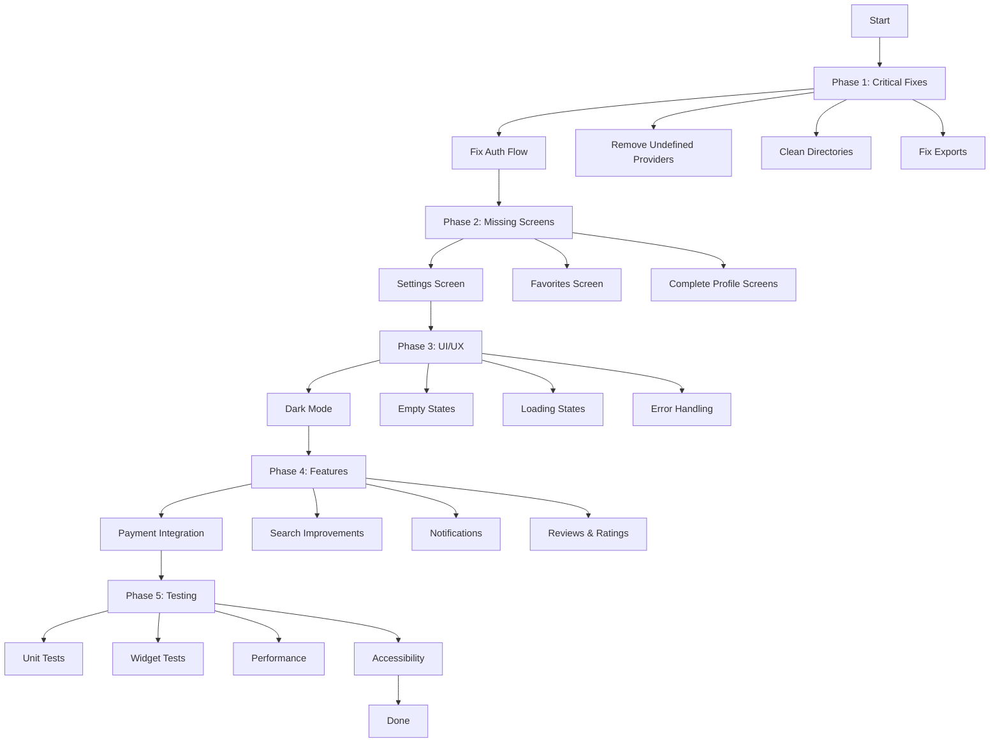

# MTF Delivery App - Implementation Plan

## Project Overview
A Flutter food delivery app with modern UI, Riverpod state management, and GoRouter navigation.

---

## Phase 1: Critical Fixes Implementation Plan

### Goal Description
Fix critical issues identified in this document to ensure a stable base for further development. This includes:
- Fixing the splash screen authentication flow
- Removing undefined Supabase provider references
- Fixing provider exports
- Cleaning up empty directories

**Note**: This plan focuses on Phase 1 tasks. Subsequent phases will be planned after these fixes are verified.

---

### Authentication & Providers

#### [MODIFY] user_provider.dart
```dart
// Add authStateProvider to manage authentication state
final authStateProvider = StateProvider<bool>((ref) {
  return false; // Default to logged-out state
});
```

**Changes**:
- Initialize with a logged-out state by default
- (Persistent storage can be implemented later)

#### [MODIFY] splash_screen.dart
```dart
// Consume authStateProvider for navigation
final isAuthenticated = ref.watch(authStateProvider);

Future.delayed(const Duration(milliseconds: 2500), () {
  if (mounted) {
    if (isAuthenticated) {
      context.go('/home');
    } else {
      context.go('/onboarding'); // Safe fallback
    }
  }
});
```

**Changes**:
- Consume authStateProvider effectively
- Navigate to `/home` if authenticated
- Navigate to `/login` or `/onboarding` if not authenticated

#### [MODIFY] providers.dart
```dart
export 'cart_provider.dart';
export 'favorites_provider.dart';
export 'language_provider.dart'; // ADD THIS LINE
export 'misc_providers.dart';
export 'navigation_provider.dart';
export 'providers.dart';
export 'user_provider.dart';
```

---

### Home Screen Fixes

#### [MODIFY] primary_home_screen.dart
```dart
// Remove supabaseClientProvider reference
final homeServicesProvider = FutureProvider<List<HomeService>>((ref) async {
  try {
    // Return mock data directly (remove Supabase call)
    return _getDefaultServices();
  } catch (e) {
    debugPrint('Failed to load services: $e');
    return _getDefaultServices();
  }
});
```

**Changes**:
- Remove usage of `supabaseClientProvider`
- Ensure `homeServicesProvider` returns mock data gracefully
- Keep `_getDefaultServices()` as fallback

---

### Cleanup

#### [DELETE] Directory: lib/screens/settings/
#### [DELETE] Directory: lib/screens/favorites/

**Note**: These directories are empty and will be re-implemented in Phase 2 with proper content.

---

### Verification Plan

#### Automated Tests
- Run: `flutter test` (if applicable)
- Run: `flutter analyze` to verify no analysis errors

#### Manual Verification
**Splash Screen Flow**:
1. Restart the app
2. Observe splash screen animation
3. Verify redirection to `/onboarding` (default auth state)
4. Test by toggling authStateProvider to true

**Home Screen**:
1. Verify home screen loads without "Provider not found" error
2. Check that service icons load (mock data)
3. Check that popular restaurants section loads
4. Verify no Supabase-related errors in console

**Code Structure**:
1. Verify `providers.dart` exports are correct
2. Confirm empty directories are removed
3. Run `flutter analyze` to check for unused imports

---

## Phase 2: Missing Screens Implementation & Integration

### Goal
Implement the missing SettingsScreen, move FavoritesScreen to its correct directory, and ensure all Profile sub-screens are correctly linked and functional.

---

### 1. Structure Organization

#### Move Favorites Screen
- **Move**: `lib/screens/profile/favorites_screen.dart` → `lib/screens/favorites/favorites_screen.dart`
- **Delete**: `lib/screens/profile/favorites_screen.dart` (after move)

---

### 2. Settings Screen Implementation

#### Create `lib/screens/settings/settings_screen.dart`

**UI Components**:
- App Settings header
- Theme Toggle (UI only or basic implementation)
- Notification Toggle (UI only)
- Language Selection (Tile)
- About/Help links

**Basic Structure**:
```dart
class SettingsScreen extends ConsumerWidget {
  const SettingsScreen({super.key});

  @override
  Widget build(BuildContext context, WidgetRef ref) {
    return Scaffold(
      appBar: AppBar(title: const Text('Settings')),
      body: ListView(
        children: [
          _buildSectionHeader('Preferences'),
          _buildToggleTile('Dark Mode', Icons.dark_mode),
          _buildToggleTile('Notifications', Icons.notifications),
          _buildTile('Language', Icons.language, () {}),
          const Divider(),
          _buildSectionHeader('Support'),
          _buildTile('About', Icons.info, () {}),
          _buildTile('Help', Icons.help, () {}),
          _buildTile('Privacy Policy', Icons.privacy_tip, () {}),
          _buildTile('Terms of Service', Icons.description, () {}),
        ],
      ),
    );
  }
}
```

---

### 3. Integration & Navigation

#### Update `lib/navigation/app_router.dart`
```dart
import '../screens/favorites/favorites_screen.dart';
import '../screens/settings/settings_screen.dart';

// Add routes
GoRoute(
  path: '/settings',
  name: 'settings',
  builder: (context, state) => const SettingsScreen(),
),
GoRoute(
  path: '/favorites',
  name: 'favorites',
  builder: (context, state) => const FavoritesScreen(),
),
```

#### Update `lib/screens/profile/profile_screen.dart`
```dart
// Add Settings menu item
ListTile(
  leading: const Icon(Icons.settings),
  title: const Text('Settings'),
  trailing: const Icon(Icons.chevron_right),
  onTap: () => context.go('/settings'),
),
```

---

### 4. Cleanup

#### [DELETE] Directory: lib/screens/settings/
#### [DELETE] Directory: lib/screens/favorites/

**Note**: These will be recreated with proper content during this phase.

---

### 5. Verification Plan

#### Automated Tests
- Run: `flutter analyze` to verify no analysis errors

#### Manual Verification
**Navigation Flow**:
1. Navigate to Profile → Settings → verify it opens
2. Navigate to Profile → Favorites → verify it opens
3. Navigate to Profile → existing sub-screens (Addresses, Coupons, etc.) → verify they open

**UI Check**:
- Settings screen displays all options
- Favorites screen shows favorited restaurants (or empty state)
- Navigation icons render correctly

---

## Phase 3: UI/UX Improvements

## Phase 3: UI/UX Improvements

### 3.1 Add Dark Mode
- **File**: `lib/core/theme/app_theme.dart`
- **Changes**:
  - Add `darkTheme` getter with dark color scheme
  - Define dark mode colors (primary, background, surface, text)
  - Add theme toggle in settings/profile

### 3.2 Empty States
- Create reusable `empty_state.dart` widget
- Apply to:
  - Cart empty state
  - Favorites empty state
  - Orders empty state
  - Search results empty state

### 3.3 Loading States
- Enhance shimmer effects consistency
- Add skeleton loaders for:
  - Home screen restaurant cards
  - Restaurant detail menu items
  - Profile information

### 3.4 Error Handling
- Implement global error boundary
- Add retry buttons for network errors
- Show user-friendly error messages

---

## Phase 4: Features Enhancement

### 4.1 Payment Integration
- Add payment method selection screen
- Credit/Debit card input
- Cash on delivery option
- Digital wallets (if applicable)
- Implement promo code functionality
- Apply discounts to cart total

### 4.2 Search Improvements
- Persist search history to shared preferences
- Add voice search option
- Implement advanced filters (cuisine, price, rating)
- Search suggestions/autocomplete

### 4.3 Notifications
- Configure Firebase Cloud Messaging
- Add notification settings screen
- Implement order status notifications:
  - Order confirmed
  - Order preparing
  - Driver on the way
  - Order delivered
- Promotional notifications (opt-in)

### 4.4 Reviews & Ratings
- Add rating system for completed orders
- Rate food quality
- Rate delivery time
- Rate driver behavior
- Display user reviews on restaurant detail

---

## Phase 5: Testing & Polish

### 5.1 Testing
- **Unit Tests**:
  - Provider tests (cart, favorites, user)
  - Model tests
  - Utility function tests

- **Widget Tests**:
  - Login screen
  - Cart screen flow
  - Home screen navigation

### 5.2 Performance
- Optimize image loading with caching
- Reduce animation overhead
- Lazy load menu categories
- Implement pagination for long lists

### 5.3 Accessibility
- Add semantic labels
- Ensure contrast ratios meet WCAG standards
- Support screen readers
- Keyboard navigation support

---

## Workflow Diagram



---

## Missing Assets

```
assets/services/
├── courier.png     Missing
├── restaurant.png  Missing
├── grocery.png     Missing
├── boutique.png    Missing
└── pharmacy.png    Missing
```

---

## File Structure After Fixes

```
lib/
├── core/
│   ├── constants/
│   │   ├── app_assets.dart Updated
│   │   ├── app_colors.dart Add dark colors
│   │   ├── app_dimensions.dart
│   │   └── app_strings.dart
│   ├── localization/
│   │   └── app_localizations.dart
│   ├── theme/
│   │   ├── app_theme.dart Add darkTheme
│   │   └── text_styles.dart
│   ├── utils/
│   ├── widgets/
│   │   ├── empty_state.dart New
│   │   └── premium_loader.dart
│   └── responsive_utils.dart
├── data/
│   ├── mock/
│   └── models/
├── navigation/
│   └── app_router.dart Update routes
├── providers/
│   ├── cart_provider.dart
│   ├── favorites_provider.dart
│   ├── language_provider.dart Export fixed
│   ├── misc_providers.dart
│   ├── navigation_provider.dart
│   ├── providers.dart Export language_provider
│   └── user_provider.dart Add authStateProvider
├── screens/
│   ├── auth/
│   ├── cart/
│   ├── checkout/
│   ├── error/
│   ├── favorites/
│   │   └── favorites_screen.dart New
│   ├── help/
│   ├── home/
│   ├── onboarding/
│   ├── order_history/
│   ├── order_tracking/
│   ├── profile/
│   ├── restaurant/
│   ├── search/
│   ├── settings/
│   │   └── settings_screen.dart New
│   └── splash/
└── main.dart
```

---

## Estimated Timeline

| Phase | Tasks | Time |
|-------|-------|------|
| Phase 1 | Critical fixes | 2-3 days |
| Phase 2 | Missing screens | 5-7 days |
| Phase 3 | UI/UX improvements | 4-5 days |
| Phase 4 | Features | 5-7 days |
| Phase 5 | Testing & polish | 3-4 days |

**Total: 3-4 weeks**

---

## Priority Order

### P0 - Critical (Must Fix)
- [ ] Fix splash screen auth bypass
- [ ] Remove undefined supabase provider
- [ ] Fix provider exports
- [ ] Clean empty directories

### P1 - High (Should Do)
- [ ] Implement Settings screen
- [ ] Implement Favorites screen
- [ ] Complete profile sub-screens
- [ ] Add empty states

### P2 - Medium (Nice to Have)
- [ ] Dark mode support
- [ ] Loading states
- [ ] Error handling improvements
- [ ] Search history persistence

### P3 - Low (Future)
- [ ] Payment integration
- [ ] Push notifications
- [ ] Reviews & ratings
- [ ] Voice search
